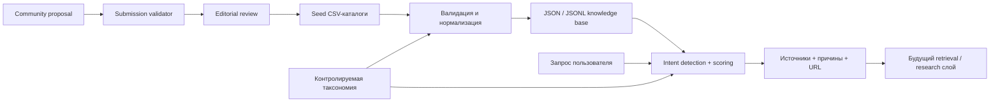

# Архитектура

## Принцип

Система разделена на два независимых слоя:

`Router` отвечает только на вопрос «где искать?». Будущий `retrieval`-слой будет отвечать на вопрос «что именно говорится в источниках?» и обязан возвращать цитаты и даты.

## Почему без embeddings на первом этапе

Для 213 коротких карточек контролируемая таксономия и лексический скоринг проще, дешевле и полностью объяснимы. Embeddings понадобятся для тысяч полнотекстовых отчётов, но не являются обязательным условием качественной маршрутизации по небольшому каталогу.

## Формула ранжирования

Максимальный балл — 100:

| Компонент | Баллы | Источник данных |
|---|---:|---|
| Совпадение категории намерения | 30 | `config/taxonomy.json` |
| Темы и `best_for` | 25 | карточка источника + routing concepts |
| Описание и тип источника | 15 | карточка источника |
| Соответствие типу бизнес-решения | 10 | `config/decision_types.json` + `decision_types` |
| Authority | 10 | пока выводится из `Priority` |
| Priority | 5 | CSV |
| Свежесть проверки | 5 | `Last_Verified` |

`authority_score` в v0.1 — не независимая экспертная оценка, а явный proxy: High = 9, Medium = 7, Low = 5. До ручной калибровки его нельзя интерпретировать как доказанный уровень достоверности.

Если запрос содержит страну или известный географический алиас, router применяет jurisdiction constraint по `config/geographies.json` и членство EU/EEA из `config/geography_regions.json`. Источники другой юрисдикции исключаются; для чувствительных доменов неизвестная география также не считается подходящей. Для остальных доменов неизвестное покрытие штрафуется и явно показывается как caveat. Если безопасного совпадения нет, система возвращает no-result и предлагает добавить локальный источник вместо уверенной рекомендации чужого регулятора. Словарь мест конечен: неизвестный город не следует интерпретировать как подтверждённую юрисдикцию.

## Граница доверия

Маршрутизатор рекомендует источник, но не подтверждает истинность отдельного отчёта или цифры. Для финального аналитического ответа нужны: дата публикации, методология, размер выборки, первичная ссылка и сравнение хотя бы с одним независимым источником для существенных утверждений.

## MCP-слой

MCP должен быть тонким адаптером, а не вторым движком. Предлагаемый контракт:

- `search_sources(query, limit, free_only)` — вызывает существующий router;
- `get_source(source_id)` — отдаёт каноническую карточку;
- `list_intents()` — отдаёт категории и routing terms;
- `research(query, constraints)` — будущий оркестратор live retrieval с цитатами.

Так CLI, MCP и любой UI будут получать идентичное ранжирование.

## Контур общественных вкладов

Community-файл всегда входит со статусом `pending`. Валидатор проверяет обязательные metadata, provenance, URL, географический словарь, ограничения доступа и дубли с production-каталогами и внутри заявки. Только редактор может перенести запись в repository-owned `community_reviewed_sources.csv`; внешний CSV не получает доверие через самостоятельно заполненные поля. Submitted authority score не считается доверенным автоматически.

Будущий retrieval-коннектор обязан резолвить DNS перед каждым запросом, запрещать все private/link-local/reserved IP и повторять проверку на каждом redirect. Статическая проверка URL при импорте не является полной SSRF-защитой.
